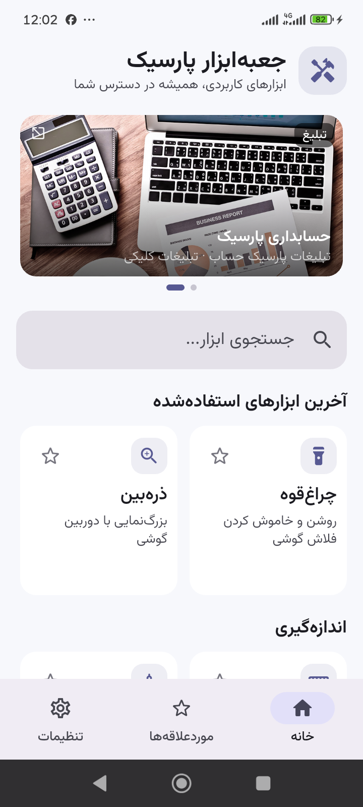
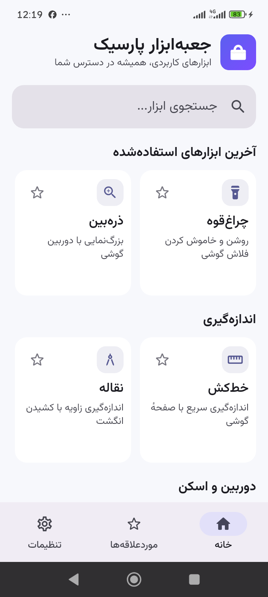
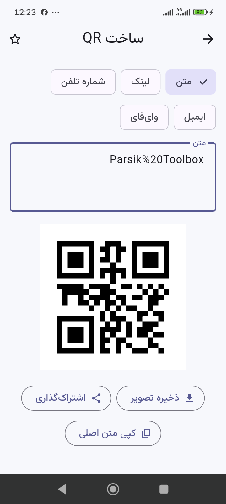
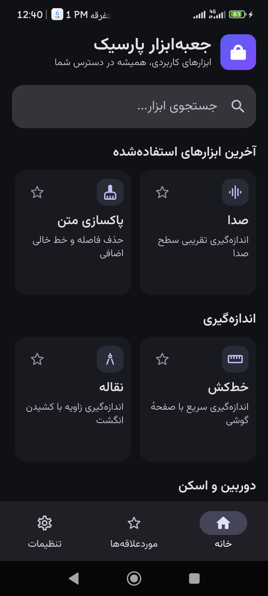
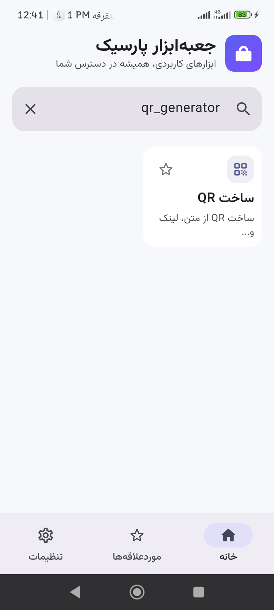

# گزارش بررسی و اصلاح جعبه‌ابزار پارسیک

تاریخ: ۲۰۲۶/۰۹/۰۶. هدف: آماده‌سازی فنی نسخهٔ اندروید برای کافه‌بازار.

## نتیجهٔ فنی

- ۱۸۵ تست واحد و ویجت موفق؛ شامل باز شدن ۱۷ ابزار در صفحهٔ ۳۲۰×۵۶۸ با فونت دوبرابر و حالت افقی ۵۶۸×۳۲۰.
- `flutter analyze` بدون خطا یا هشدار؛ `git diff --check` موفق.
- APK انتشار امضاشده برای ARM32 و ARM64؛ حداقل Android 7 / API 24 و target API 36.
- امضای APK با `apksigner` تأیید شد؛ گواهی CN=Parsik Toolbox و امضای v2.
- بررسی هم‌ترازی ZIP با `zipalign -c -P 16 4` موفق بود. این بررسی به‌تنهایی آزمون اجرای دستگاه با صفحهٔ حافظهٔ ۱۶KB نیست.
- آزمون دستگاه روی گوشی 23106RN0DA با Android 15 انجام شد. نمایش صحیح روی این گوشی یا در تست ویجت، معادل آزمون همهٔ دستگاه‌ها نیست.

## اصلاحات

1. جستجو قبل از تبلیغات قرار گرفت؛ تبلیغات به انتهای فهرست منتقل شد. نشان خانه و درباره با آیکون نصب یکسان شد.
2. جستجو حروف عربی/فارسی، نیم‌فاصله و نام انگلیسی ابزار را تشخیص می‌دهد. بازگشت ناخواستهٔ کیبورد بعد از باز کردن ابزار و تغییر تب اصلاح و روی گوشی تأیید شد.
3. کارت‌های علاقه‌مندی‌ها و ردیف‌های خانه با اندازهٔ متن سازگار شدند. صفحهٔ مجوزها و شمارندهٔ متن در فضای کوچک قابلیت پیمایش دارند.
4. رمز تولیدشده واقعاً شامل تمام گروه‌های انتخاب‌شده است؛ نمایش رمز و کد از چپ به راست است.
5. QR وای‌فای کاراکترهای ویژه را escape می‌کند، فاصلهٔ معتبر SSID را نگه می‌دارد و رمز قبلی را در شبکهٔ بدون رمز نمی‌گذارد.
6. QR بیش از ظرفیت امن ۲۰۰۰ بایت UTF-8 پیام مناسب می‌دهد. خطای ساخت/ذخیره تصویر مدیریت می‌شود و حافظهٔ تصویر آزاد می‌شود.
7. دوربین هنگام خروج آزاد و هنگام بازگشت دوباره راه‌اندازی می‌شود. خطای راه‌اندازی، خروج حین درخواست و stride مستقل کانال رنگ مدیریت شدند. اسلایدر ذره‌بین در پایین صفحه قرار گرفت.
8. چراغ‌قوه و صداسنج با خروج از برنامه متوقف می‌شوند؛ لمس‌های هم‌زمان چراغ‌قوه محافظت شده‌اند. خطای دوربین/میکروفون بازخورد مناسب دارد.
9. نبود دادهٔ سنسور به انتظار بی‌پایان منجر نمی‌شود. کالیبراسیون تراز پیش از اولین داده فعال نیست.
10. شمارش کاراکترها مبتنی بر نویسهٔ قابل‌دیدن است؛ ایموجی مرکب و حروف ترکیبی چند بار شمرده نمی‌شوند.
11. تشخیص گفتار در manifest قابل شناسایی است؛ مصرف میکروفون و احتمال پردازش آنلاین صدا در متن برنامه توضیح داده شده است.
12. ادعای نادرست «کاملاً آفلاین و بدون ارسال اطلاعات» اصلاح شد. تبلیغات، شناسهٔ نصب، فرم‌های پشتیبانی و ذخیره/اشتراک‌گذاری توضیح داده شدند.
13. لینک نصب بازار در اشتراک‌گذاری اضافه شد؛ مجوز فونت همراه اپ توزیع و مجوزهای متن‌باز از درباره قابل مشاهده‌اند.
14. fallback به امضای Debug برای انتشار حذف شد. اعلام معماری‌های APK با موتور Flutter هماهنگ شد و دسترسی سخت‌افزاری دوربین/میکروفون به‌عنوان قابلیت اختیاری اعلام شد.

## شواهد تصویری و حدود آزمون ابزارها

تصاویر زیر از اجرای همین جلسه‌اند. ابزارهای دوربین در برابر یک سطح ساده آزمایش شدند؛ کیفیت اسکن یک QR یا بارکد چاپ‌شده در این شرایط قابل تأیید نبود. تغییرات نهایی مجوز فونت و فیلتر معماری، پس از این مجموعهٔ تصاویر بسته‌بندی شدند.

| گام | ابزار و تصویر | وضعیت مشاهده‌شده و حد آزمون |
|---|---|---|
| ۱ | [خط‌کش](../artifacts/audit/device/01-ruler.png) | درجه‌بندی نمایش داده شد؛ دقت فیزیکی به کالیبراسیون نیاز دارد. |
| ۲ | [نقاله](../artifacts/audit/device/02-protractor.png) | درجه‌بندی و زاویه نمایش داده شد؛ محاسبه و بازنشانی در تست ویجت پوشش دارد. |
| ۳ | [تراز](../artifacts/audit/device/03-level.png) | دادهٔ زندهٔ شتاب‌سنج دریافت شد؛ مقایسه با تراز مرجع انجام نشد. |
| ۴ | [اسکن QR](../artifacts/audit/device/04-qr_scanner.png) | پیش‌نمایش دوربین و قاب اسکن فعال؛ اسکن فیزیکی نیازمند کد مقابل دوربین است. |
| ۵ | [بارکد](../artifacts/audit/device/05-barcode_scanner.png) | پیش‌نمایش و توضیح محدودیت محصول نمایش داده شد. |
| ۶ | [تشخیص رنگ](../artifacts/audit/device/06-color_detector.png) | HEX/RGB/HSV زنده با تصویر دوربین تغییر کرد؛ دقت رنگ کالیبره نشده است. |
| ۷ | [ذره‌بین](../artifacts/audit/device/07-magnifier.png) | تصویر و اسلایدر پایین صفحه؛ قطع و اتصال دوبارهٔ دوربین با رفتن به Home و بازگشت در dumpsys تأیید شد. |
| ۸ | [چراغ‌قوه](../artifacts/audit/device/08-flashlight.png) | روشن شدن و خاموش شدن خودکار پس از خروج روی گوشی آزمایش شد. |
| ۹ | [قطب‌نما](../artifacts/audit/device/09-compass.png) | دادهٔ زندهٔ مغناطیس‌سنج و جهت نمایش داده شد؛ دقت با مرجع جغرافیایی سنجیده نشد. |
| ۱۰ | [صداسنج](../artifacts/audit/device/10-sound_meter.png) | حالت پیش از مجوز سالم؛ سپس مجوز موقت داده شد، دادهٔ زنده دریافت و توقف پس از خروج تأیید شد. [تصویر فعال](../artifacts/audit/18-sound-active.png) |
| ۱۱ | [رمز](../artifacts/audit/device/11-password_generator.png) | تولید اولیه و گزینه‌ها سالم؛ تضمین گروه‌ها و طول در تست پوشش داده شد. رمز تصویر صرفاً خروجی آزمایشی است. |
| ۱۲ | [کد تصادفی](../artifacts/audit/device/12-random_generator.png) | تولید اولیه و تنظیمات نمایش داده شد؛ تغییر حالت/طول در تست پوشش داده شد. |
| ۱۳ | [ساخت QR](../artifacts/audit/device/13-qr_generator.png) | حالت خالی سالم؛ ساخت و ذخیرهٔ نمونه در گالری جداگانه روی گوشی تأیید شد. |
| ۱۴ | [شمارنده](../artifacts/audit/device/14-char_counter.png) | ورودی و آمار خوانا؛ متن فارسی و Unicode در تست پوشش دارد. |
| ۱۵ | [گفتار و متن](../artifacts/audit/device/15-speech_text_converter.png) | قابلیت به موتور صوتی و زبان‌های نصب‌شده وابسته است؛ کیفیت تشخیص گفتار فارسی تضمین نشده است. |
| ۱۶ | [تغییر حروف](../artifacts/audit/device/16-text_case_converter.png) | ورودی و اعمال تبدیل موجود؛ حفظ فارسی در تست پوشش دارد. |
| ۱۷ | [پاک‌سازی متن](../artifacts/audit/device/17-text_cleaner.png) | گزینه‌ها و ورودی نمایش داده شد؛ نرمال‌سازی در تست پوشش دارد. |

### خانه، قبل و بعد

### ساخت QR روی گوشی

### تم تاریک و بازگشت از جستجو

تم تاریک روی دستگاه بررسی و پس از بستن کامل و بازگشایی حفظ شد. در پایان، تم روشن اولیه بازگردانده شد.

## محدودیت‌ها و تحویل

- این بررسی به معنی تضمین نبود هر باگ یا تأیید رسمی کافه‌بازار نیست.
- هیچ گزارش خطا، درخواست تبلیغ یا پیام واقعی به پشتیبانی ارسال نشد؛ سرویس‌ها با پاسخ‌های تستی بررسی شدند. دریافت واقعی درخواست‌ها و سیاست نگهداری/حذف اطلاعات باید با مالک سرور کنترل شود.
- TalkBack، کیفیت تشخیص گفتار فارسی، عملکرد همهٔ گوشی‌ها، کالیبراسیون فیزیکی و اسکن کد چاپ‌شده همچنان آزمون مستقل می‌خواهند.
- برای سه صفحهٔ سنسوری، UIAutomator به‌علت به‌روزرسانی پیوسته گاهی به حالت idle نرسید؛ شواهد آن صفحات، تصویر واقعی صفحه است و XML آن‌ها مرجع قابل اتکا نیست.
- یک تصویر QR آزمایشی هنگام آزمون ذخیره، در گالری گوشی ایجاد شد.
- [راهنمای انتشار و متن پیشنهادی بازار](BAZAAR_RELEASE_FA.md) شامل موارد لازم برای تطبیق با پیشخان است.

خروجی: `build/app/outputs/flutter-apk/app-release.apk`.

SHA-256 بسته: `7BB5876C538183747D6FD611D65AF9F8F48DDF7104D6F3A1423CE187E99EDB2D`.
